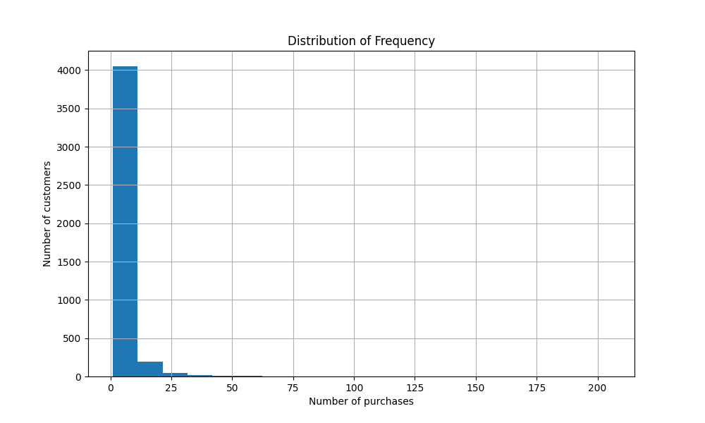

# 🛒 E-commerce Sales Analysis

This project focuses on analyzing e-commerce sales data to segment customers and improve marketing strategies through better understanding of customer behavior.

## 🛠️ Technologies Used
- 🐍 Python
- 🧮 Pandas
- 📊 Matplotlib
- 📓 Jupyter Notebook
- 🗂️ Git

## 📊 Analysis Steps

1. **📥 Data Collection**: The dataset contains sales transaction data from an online store, including information on orders, products, and customers.
   
2. **🧹 Data Cleaning**:
   - Removed missing values and duplicates.
   - Created a new column `TotalPrice`, representing the total order value (Quantity * UnitPrice).
   - Converted date fields to appropriate formats for analysis.

3. **🔍 Exploratory Data Analysis (EDA)**:
   - Analyzed distributions of key variables such as the number of items per order (**Quantity**), product prices (**UnitPrice**), and order dates (**InvoiceDate**).
   - Created histograms to visualize these distributions and uncover patterns.

4. **📅 Time Series Analysis**:
   - Examined how sales change over days and months.
   - Built time series charts to analyze seasonal trends in sales.

   Example of monthly sales:

   

5. **🧮 Customer Segmentation (RFM Analysis)**:
   - Calculated the following metrics for each customer:
     - **Recency**: Days since the customer’s last purchase.
     - **Frequency**: The number of unique purchases the customer has made.
     - **Monetary**: The total amount the customer has spent.
   - Assigned scores to each customer based on these metrics and divided them into segments:
     - **Best Customers**: Customers with a high frequency of purchases (more than 2 orders) and total spending over 1000.
     - **Loyal Customers**: Customers with more than one purchase and spending above the median (650).
     - **At Risk**: Customers who have not made a purchase in a long time (Recency >= 200).

### RFM Distribution

To better understand how customers are distributed based on Recency, Frequency, and Monetary metrics, histograms were created:

#### Recency Distribution:
   

#### Frequency Distribution:
   

#### Monetary Distribution:
   

6. **📈 Customer Segmentation Results**:

   Based on RFM scores, customers were segmented into four main categories:

   - **Best Customers**: Customers who make frequent purchases and spend significantly. These customers should be targeted with loyalty programs and special offers to maintain their engagement.
   - **Loyal Customers**: These customers buy regularly but may spend less than the best customers. Offering incentives or discounts can encourage them to spend more.
   - **At Risk**: Customers who haven't purchased in a long time. Sending personalized offers or reactivation campaigns can help re-engage these customers.
   - **Other**: Remaining customers who do not fit into the previous categories.

### Customer Segmentation Visualization

   

## 📈 Insights from RFM Segmentation

- "Best Customers" are those with frequent purchases and high spending. Focus on retaining these customers with loyalty rewards.
- "At Risk" customers haven't made a purchase in a long time, and should be targeted with reactivation strategies like personalized discounts or offers.
- "Loyal Customers" buy regularly but spend less. Offering upsell opportunities or exclusive promotions can help increase their average order value.

